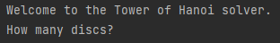
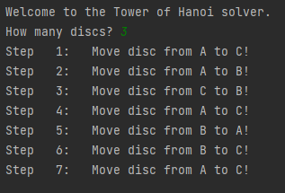

# Tower of Hanoi

## Background

Puzzle involving moving discs between rods. Full explanation can be found on [Wikipedia](https://en.wikipedia.org/wiki/Tower_of_Hanoi).

Code inpired by video: [Recursion 'Super Power' (in Python) - Computerphile](https://www.youtube.com/watch?v=8lhxIOAfDss)

## Script

Run `tower_of_hanoi.py` to get the following in the console:

Enter the number of discs to solve for. This should be:
- An integer.
- Greater than zero.
- Less than 10.

Press `Enter` and you will get the set of instructions.

The three positions are labelled __A__, __B__, and __C__.
- __A__ is the starting position for all the discs.
- __B__ is the spare position.
- __C__ is the final position for all the discs.

